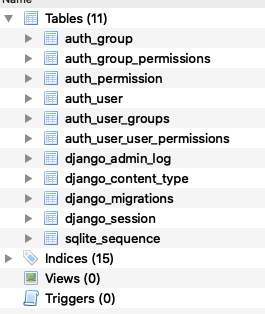
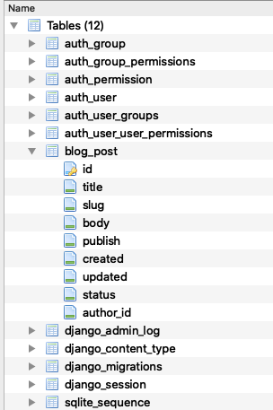
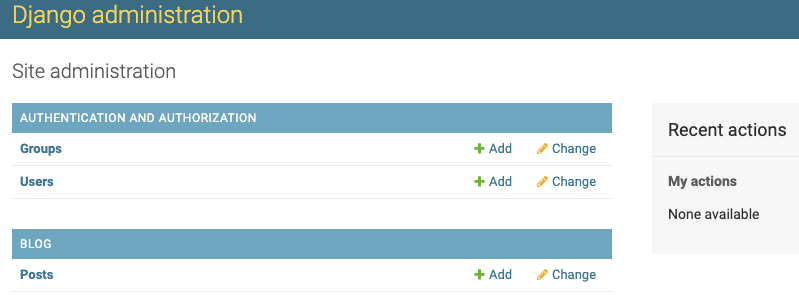
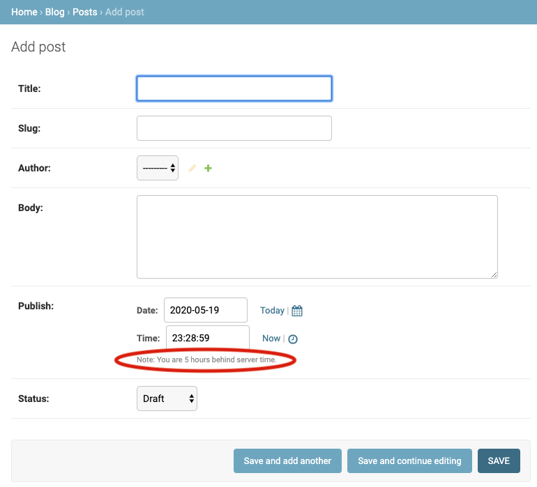
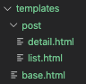

#### Project Setup

1) Create environment

    ~~~ bash
    python3 -m venv my_env
    ~~~

3) Activate virtual environment

    ~~~ bash
    source my_env/bin/activate
    ~~~

4) Install Django

    ~~~ bash
    pip install Django
    ~~~

5) Create `mysite` project

    ~~~ bash
    django-admin startproject mysite
    ~~~

6) Run migration to setup tables for applications

- NOTE: you must change directory to the project folder before running migration

    ~~~ bash
    cd mysite
    python manage.py migrate
    ~~~

- The following tables are created

    

7) Run the Django development server to verify installation

    ~~~ bash
    python manage.py runserver
    ~~~

#### Setup blog application

1) Create basic strucutre of blog application within project folder

~~~ py
python manange.py startapp blog 
~~~

2) Create the Post model
- The Post model subclasses the `django.models.Model` class in which each attribute field represents a database field
- A `slug` is a short label that contains only letters, underscores, numbers, or hyphens and is used to create SEO-friendly URLs
- the `author` field creates a `many-to-one` relationship where many posts are associated with a specific author(e.g. User)
- the `status` field uses a choices parameter to reference the constant `STATUS_CHOICES` in which only one item can be assigned. This constant is a `tuple of tuples`

    ~~~ py
    from django.db import models
    from django.utils import timezone # needed for timestamp of publish, created, & updated attributes
    from django.contrib.auth.models import User

    # Create your models here.
    class Post(models.Model):
        STATUS_CHOICES = (
            ('draft', 'Draft'),
            ('published', 'Published'),
        )

        title = models.CharField(max_length = 250)
        slug = models.SlugField(max_length = 250, unique_for_date = 'publish')
        author = models.ForeignKey(User, on_delete = models.CASCADE, related_name = 'blog_posts')
        body = models.TextField()
        publish = models.DateTimeField(default = timezone.now) # date with timezone info
        created = models.DateField(auto_now_add = True) # date when post initially created
        updated = models.DateTimeField(auto_now=True)
        status = models.CharField(max_length = 10, choices = STATUS_CHOICES, default = 'draft')

        class Meta:     # just a class container with some options (metadata)
            ordering = ('-publish', )   # the negative puts in descending order from most recently pubished

        def __str__(self):   # creates a human-readable representation of the object
            return self.title
    ~~~

3) Activate the application

- within `apps.py` is the folowing class

    ~~~ py
    class BlogConfig(AppConfig):
        name = 'blog'
    ~~~

- add the following to `mysite/settings.py` to activate the app. This tells Django tht this app belongs to projects and to load its models

    ~~~ py
    INSTALLED_APPS = [
        'blog.apps.BlogConfig',
        'django.contrib.admin',
    ~~~

4) Create initial migration for the `Post` model 

- this defines how the database will be modified
  
    ~~~ py
    python manage.py makemigrations blog
    ~~~

- to see the SQL(it won't actually be run) that Django will run to implement the migration, run the following

    ~~~ py
    python manage.py sqlmigrate blog 0001
    ~~~

5) Apply the migration

    ~~~ py
    python manage.py migrate
    ~~~

- the database now has the `blog_post` table
 
    

#### Setup Admin

1) Create `superuser`

    ~~~ py
    python manage.py createsuperuser
    ~~~

2) Register models to admin site

- orig

    ~~~ py
    from django.contrib import admin
    ~~~

- updated 
    ~~~ py
    from django.contrib import admin
    from .models import Post

    # Register your models here.
    admin.site.register(Post)
    ~~~
    
3) Launch server and log into admin panel at URL `http://127.0.0.1:8000/admin` too see the admin panel

    

4) Select Add post and note timezone message

   - message varies depending on your actual timezone

        

        - this can be resolved by modifying `TIME_ZONE` in `settings.py` to your actual timezone

        - before

            ~~~ py
            TIME_ZONE = 'UTC'
            ~~~

        - after

            ~~~ py
            TIME_ZONE = 'America/Chicago'
            ~~~

    - However, modifying `TIME_ZONE` can cause issues with Daylight Savings Time. It is recommended to use `UTC` time in the database and convert to `local time` for user interactions. <a href = "https://docs.djangoproject.com/en/3.0/topics/i18n/timezone"> see Time zones Django documentation</a>  

#### Customize admin model

1) Add the following model to `admin.py`

   - note the `admin options` 
     
   -  <a href = "https://docs.djangoproject.com/en/3.0/ref/contrib/admin/"> Django admin options </a>

    ~~~ py
    from django.contrib import admin
    from .models import Post

    # Register your models here.
    # admin.site.register(Post)

    # Custom models 
    @admin.register(Post)   # decorator performs same as admin.site.register(Post)
    class PostAdmin(admin.ModelAdmin):
        list_display = ('title', 'slug', 'author', 'publish', 'status')
        list_filter = ('status', 'created', 'publish', 'author')
        search_fields = ('title', 'body')
        prepopulated_fields = {'slug': ('title',)}
        raw_id_fields = ('author',)
        date_hierarchy = 'publish'
        ordering = ('status', 'publish')
    ~~~

#### Create list & detail views

1) Add the following views

    ~~~ py
    from django.shortcuts import render, get_object_or_404
    from .models import Post

    # Create your views here.
    def post_list(request):
        posts = Post.published.all()
        return render(request, 'blog/post/list.html', {'posts': posts})

    def post_detail(request, year, month, day, post):
        post = get_object_or_404(Post, 
                                slug = post, 
                                status = 'published', 
                                publish__yer = year,
                                publish__month = month,
                                publish__day = day)    

        return render(request, 'blog/post/detail.html', {'post': post}) 
    ~~~

2) Add URL patterns for views in the blog app

- this maps URLs to views
- the first pattern does not have arguments
- the second pattern take four arguments
- angle brackets are used to capture values from a URL as a strings
- `path converters` are used to capture values. For example, <int:year> looks for a int parameter and returns an integer. Likewise, <slug:post> matches a slug string
- <a href = "https://docs.djangoproject.com/en/3.0/topics/http/urls/#path-converters"> Django path converters</a>
- `name` maps the view
    ~~~ py
    from django.urls import path
    from . import views

    app_name = 'blog'

    urlpatterns = [
        # post views
        path('', views.post_list, name = 'post_list'),
        path('<int:year>/<int:month>/<int:day>/<slug:post>/', views.post_detail, name = 'post_detail'),
        
    ]
    ~~~

3) Update the project `urls.py`

- add the `include` import

- add the following to the `urlpatterns` variable

- the `namespace` blog allow precise reversing of `names URL patterns`

    ~~~ py

    from django.urls import path, include

    urlpatterns = [
        path('admin/', admin.site.urls),
        path('blog/', include('blog.urls', namespace = 'blog')),

    ]

    ~~~

#### Implement Canonical URLs for models

- Canonical means `preferred` and is a unique URL
- the `reverse` method allows URLs to be built using their name and also allows passing additional parameters

- Add the following to `models.py`
- import `reverse`

    ~~~ py
    from django.urls import reverse
    ~~~

- create `get_absolute_url` method to link to specific posts

    ~~~ py

    def get_absolute_url(self):
        return reverse("blog:post_detail",   # define args next, kwargs can also be implmented
                         args=[self.publish.year,
                               self.publish.month,
                               self.publish.day,
                               self.slug ])
    
    ~~~

#### Update the models
- import `reverse`

    ~~~ py
    from django.urls import reverse
    ~~~

- 

#### Create templates for the views    

1) Set up the following folders and files inside the `blog` app

    

- use template tags, template variables, and template filters to create templates

2) Create the `base.html` template

- utilizes `static files`

    ~~~ html
    
    <!DOCTYPE html>
    <html>
        <head>
            <title>  </title>
            <link href = "" rel = "stylesheet">
        </head>

        <body>

            

                

                

            

            

                <h2> My blog </h2>
                
 This is my blog 

            

        </body>

    </html>
    ~~~

1) Create the `list.html`template

- `extends` allows this template to inherit from the `base.html` file
- 2 template filters are applied in the body of the post